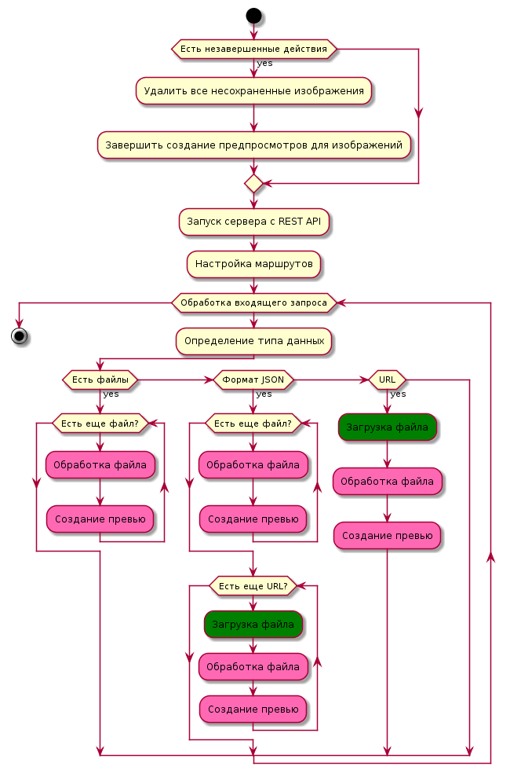

# Simple image upload API (on Golang)

## How to run

./prepare.sh && docker-composer run --build

API will be available at http://localhost:8080/api/images

## API

- GET http://localhost:8080/api/images - get JSON array of images
- GET http://localhost:8080/api/images/{id} -get image #id
- POST http://localhost:8080/api/images - upload an image or images
- POST BODY:
  multipart attachments
  url={url for downloading}
- POST BODY for application/json content type
  JSON {
    {name="{filename}",
     content="{base64 content}",
     url="{url}"}, ...
  }

## Documentation

See in sources or in ../php/docs/

Description in russian

## How to test

cd src && go test
